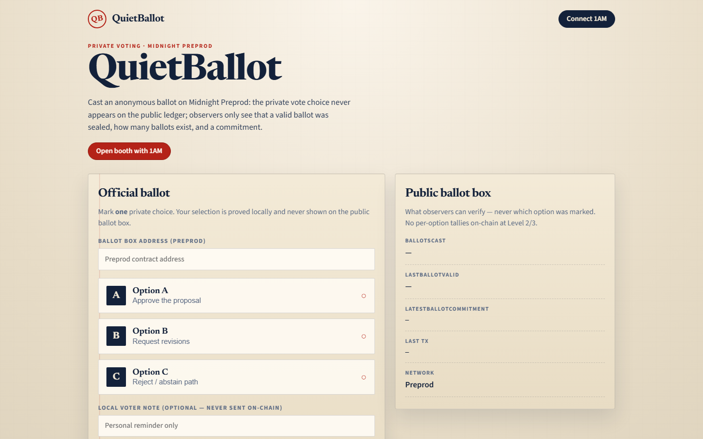
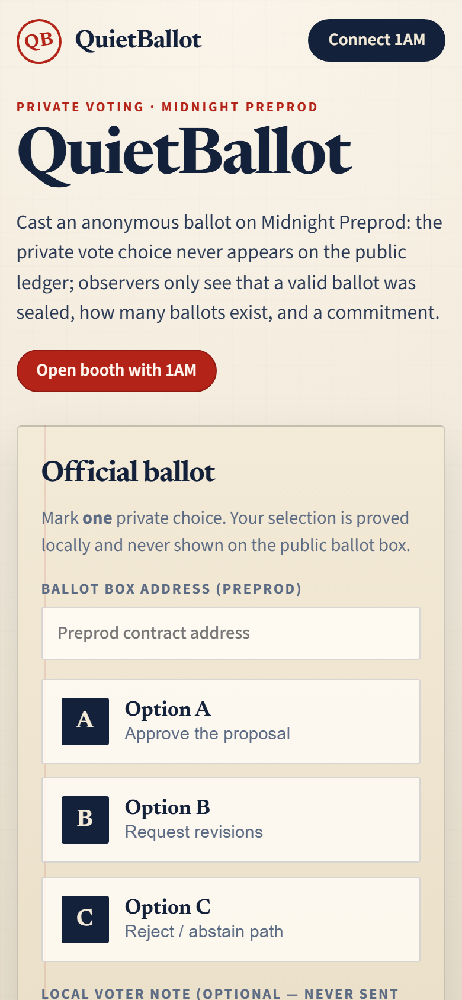
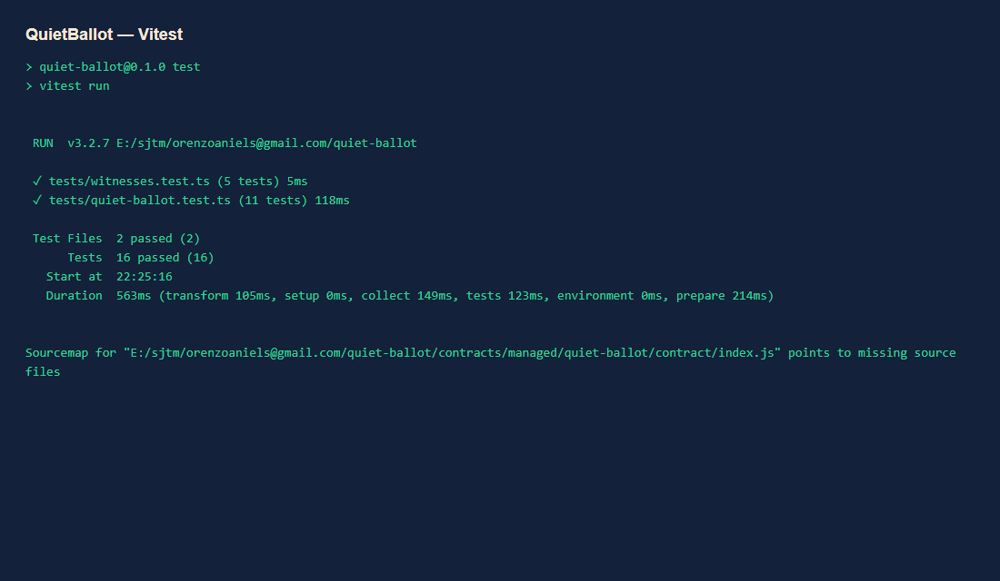
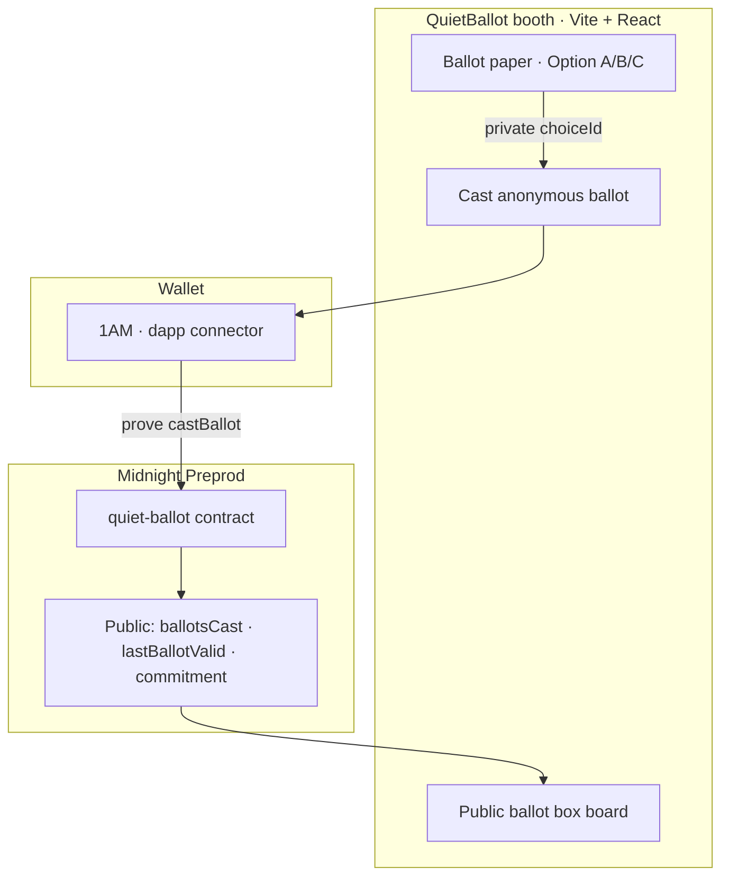

# QuietBallot

### Anonymous ballots on Midnight — publicly verifiable participation, private choices

[](https://github.com/orenzoaniels-sys/QuietBallot/actions/workflows/ci.yml)
[](./contracts/quiet-ballot.compact)
[](./tests)
[](./docs/evidence/DEPLOYMENT.md)
[](./LICENSE)

**QuietBallot** is a civic voting booth dApp: mark Option A / B / C on a paper-style ballot, prove `castBallot` on Midnight Preprod, and leave only turnout + commitment + validity on the public ledger.

> Cast an anonymous ballot on Midnight Preprod: the private vote choice never appears on the public ledger; observers only see that a valid ballot was sealed, how many ballots exist, and a commitment.

| Link | URL |
|---|---|
| Repository | https://github.com/orenzoaniels-sys/QuietBallot |
| Live demo | https://quiet-ballot.vercel.app/ |
| Demo video | see [`docs/evidence/DEMO_VIDEO.md`](./docs/evidence/DEMO_VIDEO.md) |
| Preprod contract | see [`docs/evidence/DEPLOYMENT.md`](./docs/evidence/DEPLOYMENT.md) |
| Product proposal | [`docs/evidence/PRODUCT_PROPOSAL.md`](./docs/evidence/PRODUCT_PROPOSAL.md) |
| Idea | Private Voting · Category: **Governance** |

---

## Levels overview

| Level | Name | Status |
|---|---|---|
| Level 1 | New Moon — scaffold / compile / local prove path | ✅ |
| Level 2 | Waxing Crescent — 1AM + Preprod deploy/join + live cast | ✅ (address after UI/CLI deploy) |
| Level 3 | First Quarter — ≥10 tests, CI, screenshots, proposal, privacy docs | ✅ |

---

## Level 1 checklist

| Requirement | Status |
|---|---|
| Compact 0.31.1 contract `quiet-ballot.compact` | ✅ |
| Managed artifacts under `contracts/managed/quiet-ballot/` | ✅ |
| Witness `privateBallotClaim` + LE choiceId + tag `QuietBal` | ✅ |
| Vitest encoding / ledger smoke | ✅ |
| MIT license + Node ≥22 | ✅ |

---

## Level 2 checklist

| Requirement | Status |
|---|---|
| Midnight.js 4.1.1 + dapp-connector-api | ✅ |
| 1AM connect / disconnect / address / errors | ✅ |
| Loading “Proving ballot…” | ✅ |
| `castBallot` from UI with local/wallet proving | ✅ |
| Private choice never on public ballot-box board; cleared after cast | ✅ |
| Deploy + Join (indexer, no watch hang) | ✅ |
| Live Vercel demo | ✅ https://quiet-ballot.vercel.app/ |
| Preprod address in README + DEPLOYMENT | ✅ / fill after deploy |
| Privacy model (observer can / cannot) | ✅ |
| ≥8 meaningful commits | ✅ |
| Vitest ≥6 early | ✅ (16) |

---

## Level 3 checklist

| Requirement | Status |
|---|---|
| ≥10 Vitest tests (prefer 13) | ✅ **16** |
| CI on push to main (test + sync-zk + web build) | ✅ |
| README CI badge | ✅ |
| Privacy core + observer table | ✅ |
| `docs/evidence/PRODUCT_PROPOSAL.md` (non-root) | ✅ |
| Preprod-labeled address + ≥10 commits | ✅ |
| Screenshots: desktop / mobile / tests | ✅ |
| DEMO_VIDEO.md + README placeholder | ✅ |
| Mobile responsive ≤720px | ✅ |
| CODE_QUALITY.md | ✅ |
| README L1/L2/L3 tables | ✅ |

---

## Screenshots

| Desktop live | Mobile (~390) |
|---|---|
|  |  |

| Test results |
|---|
|  |

---

## Privacy — what an observer sees

| | |
|---|---|
| **Observer CAN** | Read `ballotsCast`, `lastBallotValid`, `latestBallotCommitment` |
| **Observer CANNOT** | Learn whether you marked A, B, or C — `choiceId` + claim stay private |

No per-option tallies are published on-chain in Level 2/3 (would weaken anonymity).

---

## Architecture



---

## CI

GitHub Actions (`.github/workflows/ci.yml`):

1. `npm ci`
2. `npm test`
3. `npm run web:sync-zk`
4. `npm --prefix web ci`
5. `npm --prefix web run build`

---

## Preprod deployment

| Field | Value |
|---|---|
| Network | **Preprod** |
| Contract | see [`docs/evidence/DEPLOYMENT.md`](./docs/evidence/DEPLOYMENT.md) |
| Faucet | https://faucet.preprod.midnight.network |
| Indexer | `https://indexer.preprod.midnight.network/api/v4/graphql` |

```bash
# Optional CLI (local proof server + funded seed)
MIDNIGHT_SEED=<64-hex> npm run deploy:preprod

# Or Deploy ballot box in the UI, then:
MIDNIGHT_CONTRACT_ADDRESS=<addr> RECORD_ONLY=1 npm run deploy:preprod
```

---

## Quick start

```bash
# Contract compile (WSL / compact CLI)
npm run compile:wsl

npm install
npm test
npm run web:sync-zk
npm --prefix web install
npm --prefix web run dev
```

---

## Product proposal

Full Idea Submission answers (Q1/Q2), data model, and L4–6 scope:

→ [`docs/evidence/PRODUCT_PROPOSAL.md`](./docs/evidence/PRODUCT_PROPOSAL.md)

---

## License

[MIT](./LICENSE)
